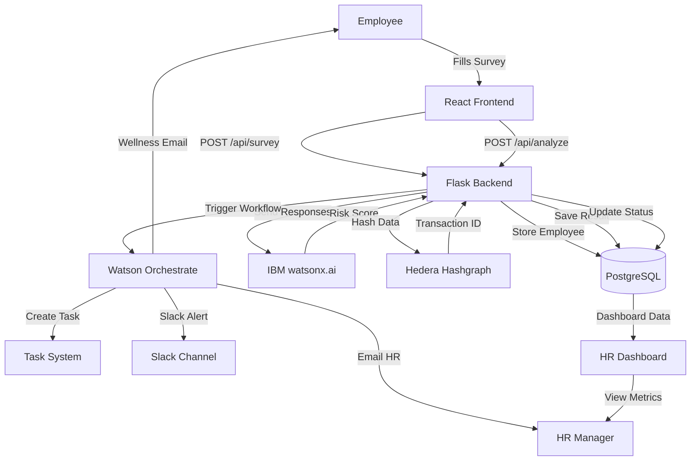

# VorteX WellMind – Workflow Diagram

## End-to-End Flow



## Risk Scoring Logic

```
Input Factors:
- Work Hours (weight: 35%)
- Stress Level (weight: 30%)
- Workload (weight: 20%)
- Team Support (weight: 10%)
- Sleep Hours (weight: 5%)

Score = (hours/40)*35 + (stress/10)*30 + (workload/10)*20 
        + (10-support)/10*10 + (7-sleep)/7*5

Risk Labels:
- 0-40: Low
- 41-60: Medium
- 61-80: High
- 81-100: Urgent
```

## Orchestrate Workflow Decision Tree

```
Risk Score Received
    |
    ├─ Score > 80 (Urgent)
    │   ├─ Email HR (urgent template)
    │   ├─ Slack #hr-alerts
    │   ├─ Create high-priority task
    │   └─ Schedule 1-on-1 meeting
    |
    ├─ Score 61-80 (High)
    │   ├─ Email HR (high risk template)
    │   ├─ Create follow-up task
    │   └─ Send wellness resources
    |
    ├─ Score 41-60 (Medium)
    │   ├─ Send wellness nudge to employee
    │   └─ Log for monitoring
    |
    └─ Score 0-40 (Low)
        └─ No action, log only
```

## Database Schema

```sql
┌─────────────────┐         ┌──────────────────────┐
│   employees     │         │  burnout_results     │
├─────────────────┤         ├──────────────────────┤
│ id (PK)         │◄────────│ employee_id (FK)     │
│ name            │         │ risk_score           │
│ department      │         │ label                │
│ email           │         │ watson_timestamp     │
└─────────────────┘         │ hedera_txid          │
                            │ orchestrate_status   │
                            └──────────────────────┘
```

## API Endpoints

| Method | Endpoint | Purpose |
|--------|----------|---------|
| POST | /api/survey | Submit employee data |
| POST | /api/analyze | Trigger AI analysis |
| POST | /api/orchestrate/callback | Receive workflow updates |
| GET | /api/dashboard | Get HR metrics |
| GET | /api/employees | List all employees |
| GET | /api/health | Health check |

## Integration Points

1. **watsonx.ai**: POST to inference endpoint with survey text
2. **Hedera**: FileCreateTransaction with SHA-256 hash
3. **Orchestrate**: POST to workflow trigger URL
4. **PostgreSQL**: SQLAlchemy ORM for all data operations
5. **React**: Fetch API calls to Flask backend

## Security Flow

```
Frontend (HTTPS) → Backend (JWT Auth) → Database (Encrypted)
                           ↓
                    Blockchain Hash (Public Testnet)
                           ↓
                    Orchestrate (API Key Auth)
```

Future: Add OAuth 2.0, RBAC, field-level encryption
